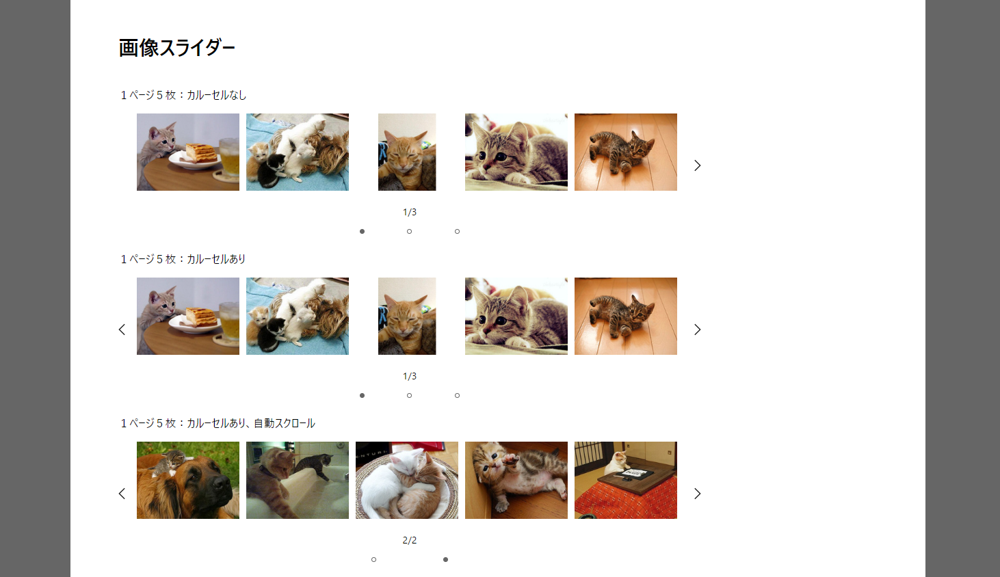

🌙 jquery-isystkSlider
====


## 📗 プロジェクトの概要

jQueryで作成した汎用画像スライダーです。

### 対応している機能
- カルーセル（永続的に回転）するかを指定できる
- 1ページに含める子要素の数を指定できる
- スワイプの利用が指定できる
- 自動でページングさせる事が出来る
- 縦方向のスライドが出来る
- ピンチアウトによる画像の拡大・縮小が出来る

## 🌐 Demo

#### ■ フロント画面（React）

https://isystk.github.io/jquery-isystkSlider



## 💬 使い方

各種デーモンを起動する
```
$ npm install
$ npm run dev
```

## 🎨 参考

| プロジェクト                                                       | 概要                                            |
|:-------------------------------------------------------------|:----------------------------------------------|
| [Tailwind CSS](https://tailwindcss.com/docs)                 | Tailwind CSS公式ドキュメントです。                       |


## 🎫 Licence

[MIT](https://github.com/isystk/jquery-isystkSlider/blob/master/LICENSE)

## 👀 Author

[isystk](https://github.com/isystk)


